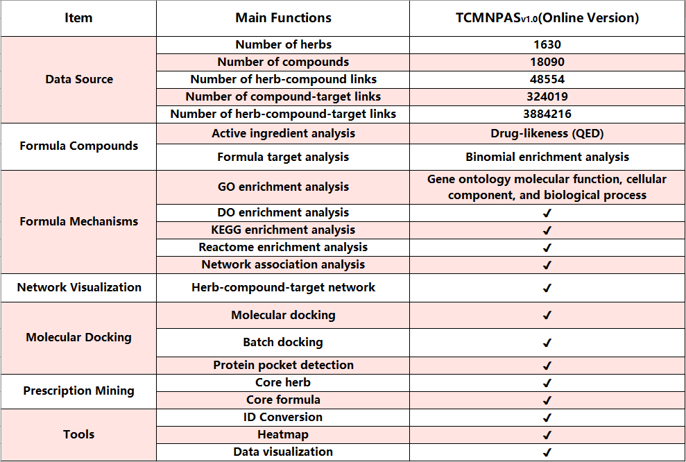

# tcmnpas: TCM Network Pharmacology Analysis System

***
The TCM Network Pharmacology Analysis System (TCMNPAS), registered with the National Copyright Administration of China under the registration number 2019SR1127090, is primarily used for network pharmacology analysis of traditional Chinese medicine formulations and their active ingredients. It provides an all-in-one solution for complex data analysis. The online version of TCMNPASv1.0 system offers 8 functional modules for users.

*For details, please visit our project website,
*TCMNPAS(http://54.223.75.62:3838/).

-----
***
Please cite the following article when using `tcmnpas`:
*LongHua Hospital Shanghai University of Traditional Chinese Medicine,YangMing. TCM Network Pharmacology Analysis System v1.0[CP/CD],Copyright Registration No.,2019SR1127090.


## Installation
Alternatively you can grab the
development version from github using devtools:
``` r
# install.packages("devtools")
devtools::install_github("yangpluszhu/tcmnpas")
```
***

***

