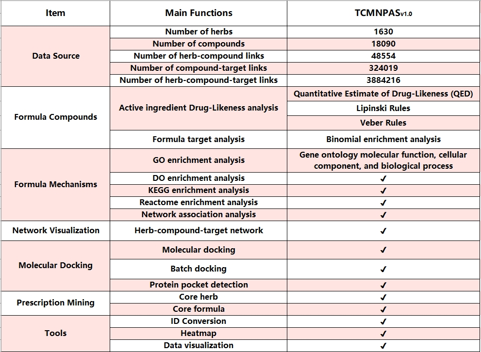

# tcmnpas: A comprehensive analysis platform for exploring traditional Chinese medicine

***
 The TCM Network formulaology and Pharmacology Analysis System (TCMNPAS), registered with the National Copyright Administration of China under the registration number 2019SR1127090. TCMNPAS incorporates multiple resources and offers a range of functions designed for automated analysis implementation, including prescription mining, molecular docking, network pharmacology analysis, and visualization. The online version of TCMNPASv1.0 system offers 8 functional modules for users.

*For details, please visit our project website,   
*TCMNPAS(http://54.223.75.62:3838/).

-----
***
Please cite when using `tcmnpas`:   
*1. Liu, Y., Li, X., Chen, C., Ding, N., Zheng, P., Chen, X., Ma, S., & Yang, M. TCMNPAS: a comprehensive analysis platform integrating network formulaology and network pharmacology for exploring traditional Chinese medicine. Chinese Medicine, 2024, 19(1): 50. https://doi.org/10.1186/s13020-024-00924-y  
*2. LongHua Hospital Shanghai University of Traditional Chinese Medicine,YangMing. TCM Network Pharmacology Analysis System v1.0[CP/CD],Copyright Registration No.,2019SR1127090.   
*3. Yang Ming. (2024). tcmnpas: A comprehensive analysis platform for exploring traditional Chinese medicine. GitHub. https://github.com/yangpluszhu/tcmnpas. GPL-3.0 License.


## Installation
Alternatively you can grab the
development version from github using devtools:
``` r
# install.packages("devtools")
devtools::install_github("yangpluszhu/tcmnpas")
```
***

***

